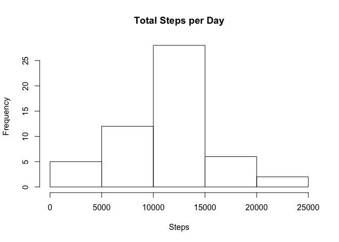
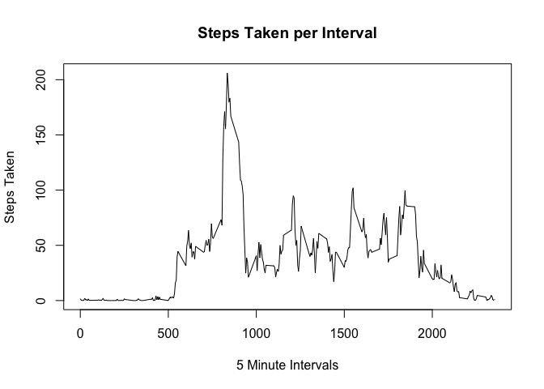
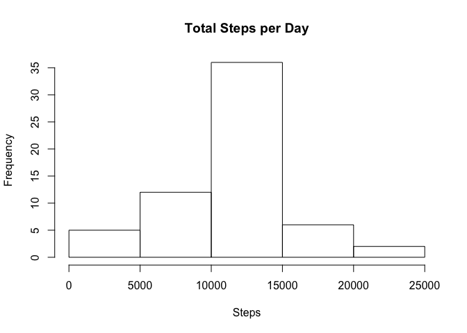
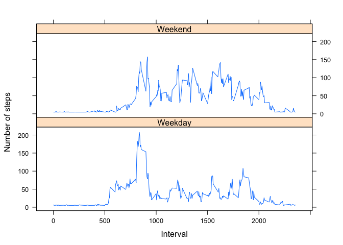

# Reproducible Research: Peer Assessment 1
Ryan Meyer  
February 14, 2015  

## Loading and preprocessing the data

```r
unzip("activity.zip")
df <- read.csv("activity.csv", header=TRUE, sep=",", quote="\"")
```

## What is mean total number of steps taken per day?

```r
countStepsPerDay <- aggregate(steps ~ date, df, sum)
hist(countStepsPerDay$steps, main="Total Steps per Day", xlab="Steps")
```

 

```r
mean(countStepsPerDay$steps) # mean of total steps per day
```

```
## [1] 10766.19
```

```r
median(countStepsPerDay$steps) # median of total steps per day
```

```
## [1] 10765
```

## What is the average daily activity pattern?

```r
dfDaily <- aggregate(steps ~ interval, df, mean)
plot(dfDaily$interval, dfDaily$steps, 
   type="l", 
   xlab="5 Minute Intervals", 
   ylab="Steps Taken", 
   main="Steps Taken per Interval")
```

 

```r
head(dfDaily[order(-dfDaily[,2]), ], 1)$interval # 5 minute interval with maximum steps
```

```
## [1] 835
```

## Imputing missing values

```r
nrow(subset(df, is.na(steps) == TRUE)) # count of NA values for steps
```

```
## [1] 2304
```

```r
meanSteps <- aggregate(steps ~ date, df, mean)
meanStep <- mean(meanSteps$steps) # mean of steps taken across entire data set.
dfNoNa <- df
dfNoNa$steps[is.na(dfNoNa$steps)] <- meanStep

countStepsPerDayNoNa <- aggregate(steps ~ date, dfNoNa, sum)
hist(countStepsPerDayNoNa$steps, main="Total Steps per Day", xlab="Steps")
```

 

```r
mean(countStepsPerDayNoNa$steps) # mean of steps per day with imputed values
```

```
## [1] 10766.19
```

```r
median(countStepsPerDayNoNa$steps) # median of steps per day with imputed values
```

```
## [1] 10766.19
```
Missing values made the median match the mean. The imputed histogram also has a higher frequency across all 
bars.

## Are there differences in activity patterns between weekdays and weekends?

```r
library(lattice)
```

```
## Warning: package 'lattice' was built under R version 3.1.2
```

```r
dfNoNa$dayType <- ifelse (weekdays(as.POSIXct(dfNoNa$date)) == "Sunday" | weekdays(as.POSIXct(dfNoNa$date)) == "Saturday", "Weekend", "Weekday")

weekend <- aggregate(steps ~ interval, subset(dfNoNa, dayType == "Weekend"), mean)
weekend$dayType <- "Weekend"
weekday <- aggregate(steps ~ interval, subset(dfNoNa, dayType == "Weekday"), mean)
weekday$dayType <- "Weekday"

ww <- rbind(weekend, weekday)

xyplot(steps ~ interval | factor(dayType), 
       data=ww, 
       type="l",
       layout=c(1,2),
       xlab="Interval",
       ylab="Number of steps")
```

 
